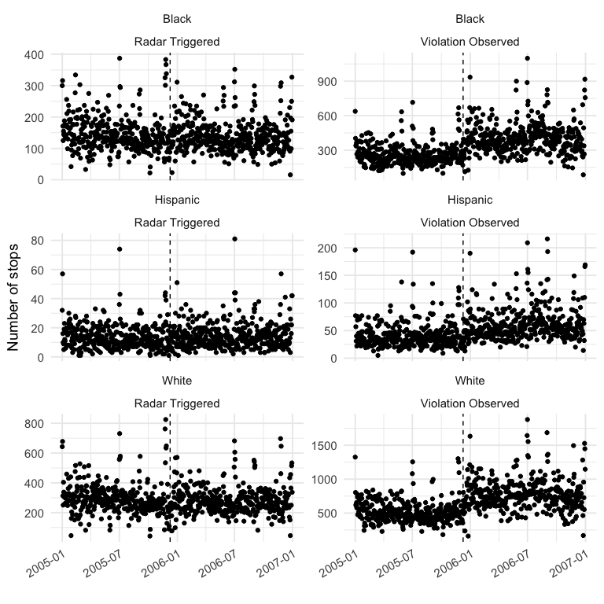
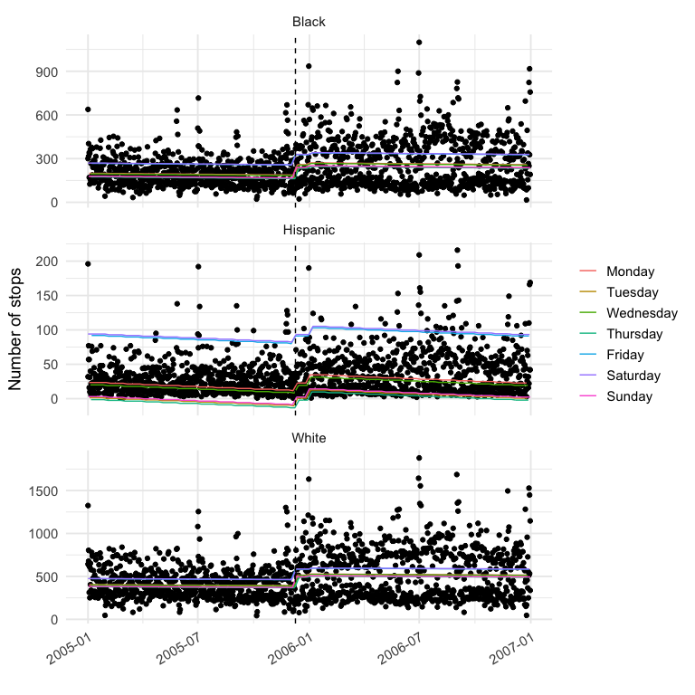
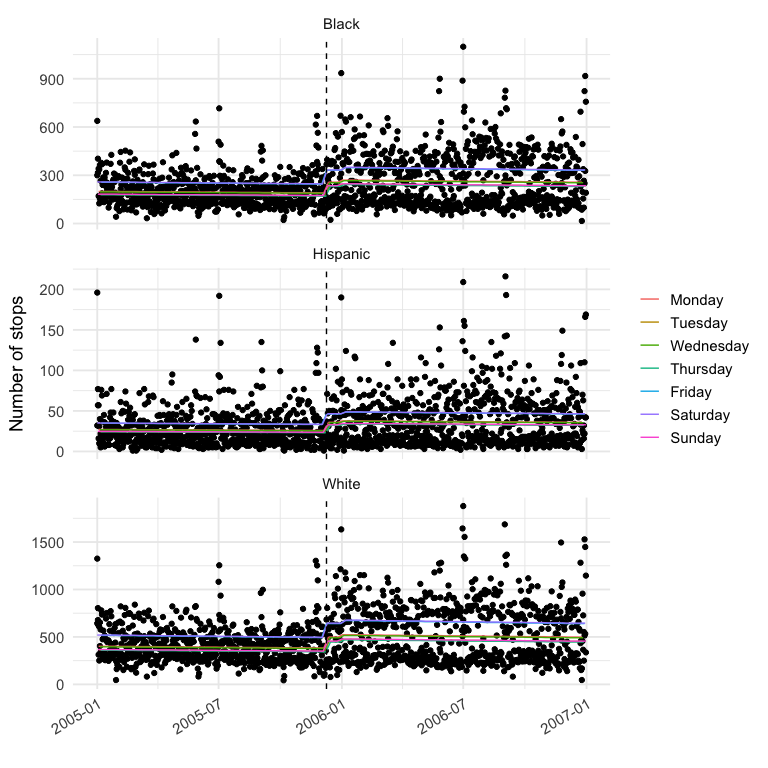
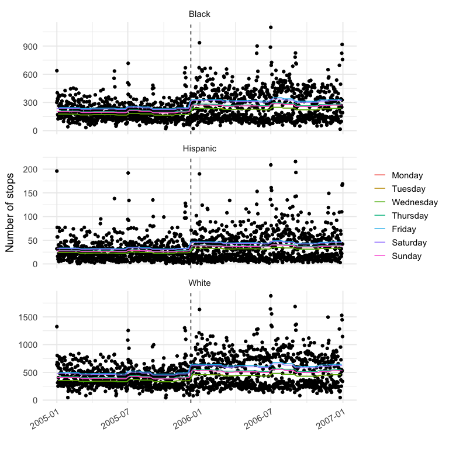

Traffic Stop Analysis
================
Sara Stoudt
3/9/2021

## Setup

``` r
#install.packages("tidyverse") ## install if haven't already done so
#install.pacakges("mgcv") ## install if haven't already done so
#install.pacakges("lubridate") ## install if haven't already done so

library(tidyverse)
library(mgcv)
library(lubridate)
```

``` r
data <- read.csv("../Data/dailyStops.csv")

data$date2 <- as.Date(as.character(data$date2)) ## Date class rather than factor

data$day_of_week <- factor(data$day_of_week, levels = levels(data$day_of_week)[c(2, 6, 7, 5, 1, 3, 4)]) ## relevel Monday onward 
```

## Exploratory Data Analysis

``` r
## Slide 4 Figure
ggplot(data, aes(x = date2, y = daily_num_stops)) +
  facet_wrap(race ~ stop_purpose2, scales = "free_y", ncol = 2) +
  geom_point() +
  geom_vline(xintercept = as.Date("2005-12-09"), lty = 2) +
  theme_minimal(base_size = 14) +
  theme(
    legend.title = element_blank(), # legend.position = "bottom" #,
    axis.text.x = element_text(angle = 30, hjust = 1)
  ) +
  labs(y = "Number of stops", x = "")
```

<!-- -->

## Linear Model

``` r
## Slide 5
linear_model <- lm(daily_num_stops ~ driver_race + post_policy + driver_race * post_policy + day_of_week + month, data = data)

summary(linear_model)
```

    ## 
    ## Call:
    ## lm(formula = daily_num_stops ~ driver_race + post_policy + driver_race * 
    ##     post_policy + day_of_week + month, data = data)
    ## 
    ## Residuals:
    ##     Min      1Q  Median      3Q     Max 
    ## -469.50  -87.97    1.38   57.47 1287.57 
    ## 
    ## Coefficients:
    ##                                  Estimate Std. Error t value Pr(>|t|)    
    ## (Intercept)                      200.0461     9.6728  20.681  < 2e-16 ***
    ## driver_raceHispanic             -175.4626     8.7787 -19.987  < 2e-16 ***
    ## driver_raceWhite                 205.2749     8.7755  23.392  < 2e-16 ***
    ## post_policy                       71.5892     8.5259   8.397  < 2e-16 ***
    ## day_of_weekTuesday               -22.0114     9.1878  -2.396   0.0166 *  
    ## day_of_weekWednesday              -3.4587     9.1879  -0.376   0.7066    
    ## day_of_weekThursday              -24.8897     9.1918  -2.708   0.0068 ** 
    ## day_of_weekFriday                 68.3819     9.1884   7.442 1.19e-13 ***
    ## day_of_weekSaturday               70.5354     9.1662   7.695 1.74e-14 ***
    ## day_of_weekSunday                -20.5078     9.1659  -2.237   0.0253 *  
    ## month                             -1.0785     0.7151  -1.508   0.1316    
    ## driver_raceHispanic:post_policy  -60.4253    12.0393  -5.019 5.40e-07 ***
    ## driver_raceWhite:post_policy      51.5331    12.0370   4.281 1.90e-05 ***
    ## ---
    ## Signif. codes:  0 '***' 0.001 '**' 0.01 '*' 0.05 '.' 0.1 ' ' 1
    ## 
    ## Residual standard error: 162.3 on 4366 degrees of freedom
    ## Multiple R-squared:  0.575,  Adjusted R-squared:  0.5739 
    ## F-statistic: 492.3 on 12 and 4366 DF,  p-value: < 2.2e-16

``` r
data$predLM <- predict(linear_model) ## store predicted values
```

``` r
ggplot(data, aes(x = date2, y = daily_num_stops)) +
  facet_wrap(~race, scales = "free_y", ncol = 1) +
  geom_point() +
  geom_line(aes(x = date2, y = predLM, col = day_of_week)) +
  geom_vline(xintercept = as.Date("2005-12-09"), lty = 2) +
  theme_minimal(base_size = 14) +
  theme(
    legend.title = element_blank(), # legend.position = "bottom" #,
    axis.text.x = element_text(angle = 30, hjust = 1)
  ) +
  labs(y = "Number of stops", x = "")
```

<!-- -->

## Generalized Linear Model

``` r
## Slide 6
generalized_linear_model <- glm(daily_num_stops ~ driver_race + post_policy + driver_race * post_policy + day_of_week + month, data = data, family = "quasipoisson")
summary(generalized_linear_model)
```

    ## 
    ## Call:
    ## glm(formula = daily_num_stops ~ driver_race + post_policy + driver_race * 
    ##     post_policy + day_of_week + month, family = "quasipoisson", 
    ##     data = data)
    ## 
    ## Deviance Residuals: 
    ##     Min       1Q   Median       3Q      Max  
    ## -26.916   -5.885   -1.194    4.269   38.670  
    ## 
    ## Coefficients:
    ##                                  Estimate Std. Error t value Pr(>|t|)    
    ## (Intercept)                      5.300683   0.032632 162.439  < 2e-16 ***
    ## driver_raceHispanic             -1.997720   0.063874 -31.276  < 2e-16 ***
    ## driver_raceWhite                 0.698847   0.026995  25.888  < 2e-16 ***
    ## post_policy                      0.302333   0.028405  10.644  < 2e-16 ***
    ## day_of_weekTuesday              -0.096519   0.030837  -3.130 0.001760 ** 
    ## day_of_weekWednesday            -0.014574   0.030196  -0.483 0.629363    
    ## day_of_weekThursday             -0.109705   0.030949  -3.545 0.000397 ***
    ## day_of_weekFriday                0.251005   0.028354   8.852  < 2e-16 ***
    ## day_of_weekSaturday              0.258257   0.028258   9.139  < 2e-16 ***
    ## day_of_weekSunday               -0.089411   0.030693  -2.913 0.003597 ** 
    ## month                           -0.004370   0.002278  -1.918 0.055121 .  
    ## driver_raceHispanic:post_policy  0.029594   0.081672   0.362 0.717109    
    ## driver_raceWhite:post_policy    -0.037925   0.034789  -1.090 0.275717    
    ## ---
    ## Signif. codes:  0 '***' 0.001 '**' 0.01 '*' 0.05 '.' 0.1 ' ' 1
    ## 
    ## (Dispersion parameter for quasipoisson family taken to be 67.57155)
    ## 
    ##     Null deviance: 998623  on 4378  degrees of freedom
    ## Residual deviance: 284627  on 4366  degrees of freedom
    ## AIC: NA
    ## 
    ## Number of Fisher Scoring iterations: 5

``` r
data$predGLM <- predict(generalized_linear_model, type = "response") ## store predicted values on response scale
```

``` r
ggplot(data, aes(x = date2, y = daily_num_stops)) +
  facet_wrap(~race, scales = "free_y", ncol = 1) +
  geom_point() +
  geom_line(aes(date2, predGLM, col = day_of_week)) +
  geom_vline(xintercept = as.Date("2005-12-09"), lty = 2) +
  theme_minimal(base_size = 14) +
  theme(
    legend.title = element_blank(), # legend.position = "bottom" #,
    axis.text.x = element_text(angle = 30, hjust = 1)
  ) +
  labs(y = "Number of stops", x = "")
```

<!-- -->

## Generalized Additive Model

``` r
## Slide 10

data$day_of_week_num <- as.numeric(data$day_of_week) ## now want to allow smoothness across days of week rather than a separate coefficient for each day

generalized_additive_model <- gam(daily_num_stops ~ driver_race + post_policy + driver_race * post_policy + s(day_of_week_num, bs = "cc", k = 4) + s(month, bs = "cc"), data = data, family = "quasipoisson")

summary(generalized_additive_model)
```

    ## 
    ## Family: quasipoisson 
    ## Link function: log 
    ## 
    ## Formula:
    ## daily_num_stops ~ driver_race + post_policy + driver_race * post_policy + 
    ##     s(day_of_week_num, bs = "cc", k = 4) + s(month, bs = "cc")
    ## 
    ## Parametric coefficients:
    ##                                 Estimate Std. Error t value Pr(>|t|)    
    ## (Intercept)                      5.30699    0.02245 236.349   <2e-16 ***
    ## driver_raceHispanic             -1.99749    0.06488 -30.789   <2e-16 ***
    ## driver_raceWhite                 0.69885    0.02742  25.487   <2e-16 ***
    ## post_policy                      0.29683    0.02888  10.277   <2e-16 ***
    ## driver_raceHispanic:post_policy  0.02937    0.08296   0.354    0.723    
    ## driver_raceWhite:post_policy    -0.03792    0.03534  -1.073    0.283    
    ## ---
    ## Signif. codes:  0 '***' 0.001 '**' 0.01 '*' 0.05 '.' 0.1 ' ' 1
    ## 
    ## Approximate significance of smooth terms:
    ##                      edf Ref.df       F p-value    
    ## s(day_of_week_num) 1.985      2 119.456 < 2e-16 ***
    ## s(month)           6.952      8   2.543 0.00336 ** 
    ## ---
    ## Signif. codes:  0 '***' 0.001 '**' 0.01 '*' 0.05 '.' 0.1 ' ' 1
    ## 
    ## R-sq.(adj) =  0.574   Deviance explained = 70.8%
    ## GCV = 67.129  Scale est. = 69.712    n = 4379

``` r
data$predGAM <- predict(generalized_additive_model, type = "response")
```

``` r
ggplot(data, aes(x = date2, y = daily_num_stops)) +
  facet_wrap(~race, scales = "free_y", ncol = 1) +
  geom_point() +
  geom_line(aes(date2, predGAM, col = day_of_week)) +
  geom_vline(xintercept = as.Date("2005-12-09"), lty = 2) +
  theme_minimal(base_size = 14) +
  theme(
    legend.title = element_blank(), # legend.position = "bottom" #,
    axis.text.x = element_text(angle = 30, hjust = 1)
  ) +
  labs(y = "Number of stops", x = "")
```

<!-- -->

``` r
data$doy= yday(data$stop_date) 
```
